# StupidHackTH2-screen

Information system used in The Stupid Hackathon Thailand #2. Features include:

- On-screen announcement system
- Voting system

Check out [dtinth/auden](https://github.com/dtinth/auden) for a more generic
successor to this project.

## Feature tour

The **information display** (`#/display`) is to be projected to a 1920x1080
screen. By default it displays a clock, a logo, and sponsors.

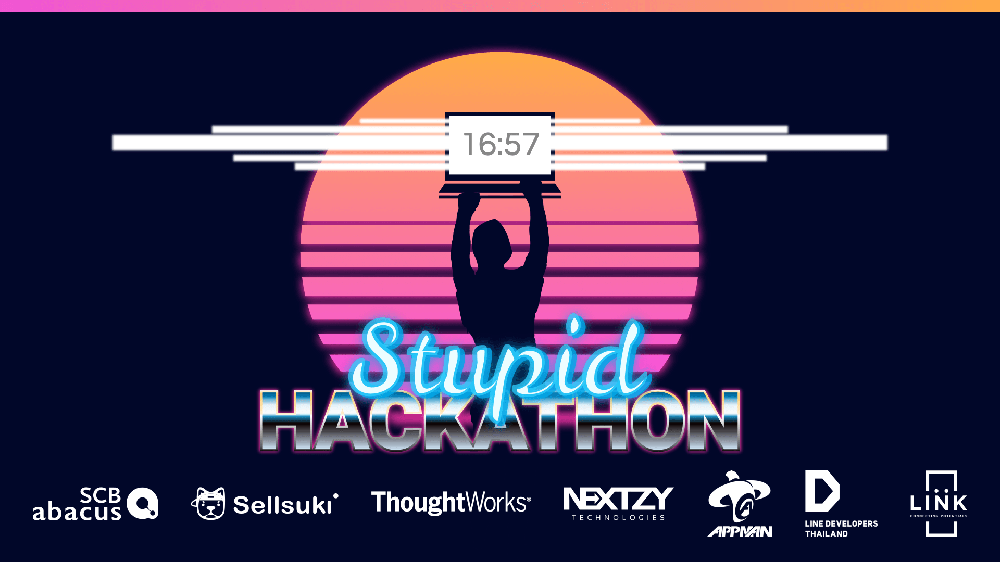

Arbitrary information can be displayed in three display modes. There are
**smooth animations** when transitioning between these 3 modes.
[**&rarr; See video demo!**](https://youtu.be/x2bmVoGfaWE)

1. Displayed inside the screen:

   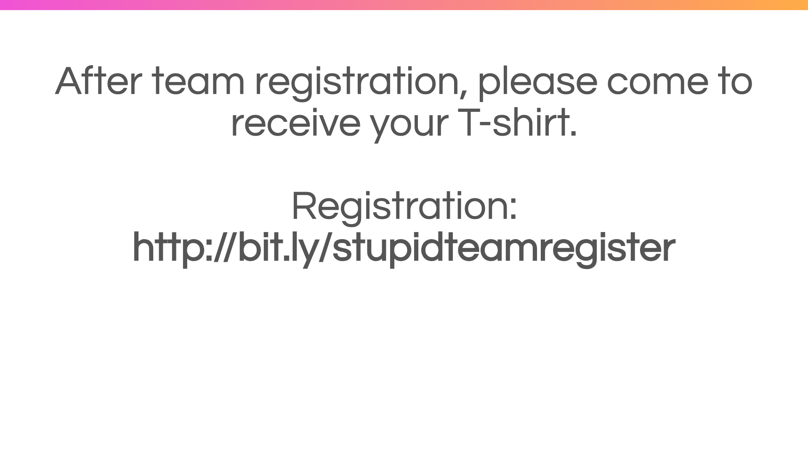

2. Displayed as a curtain that rolls down from the top:

   

3. Displayed in a floating window which can be overlaid on top of on any mode.

   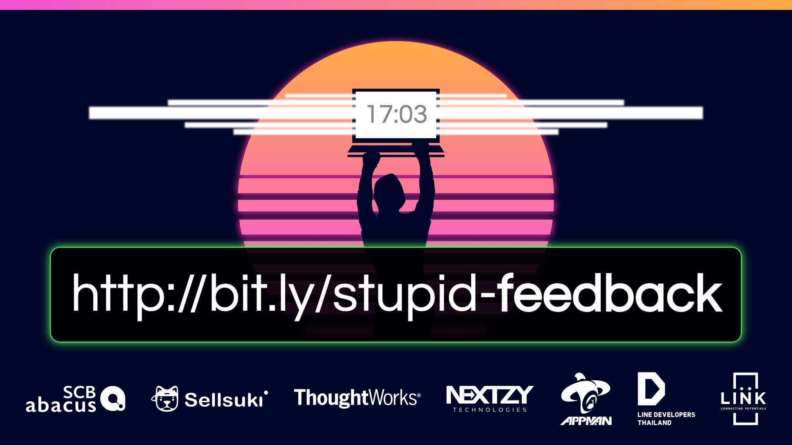

This screen is controlled remotely via Firebase. By changing the values in
Firebase console. The screen is updated in real time.

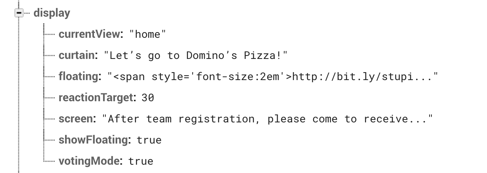

There is also a **reaction system**. After each project’s pitching, the audience
can give reactions to a project.

| Stage                                                                                                                                                         | Phone                         | Screen                        |
| ------------------------------------------------------------------------------------------------------------------------------------------------------------- | ----------------------------- | ----------------------------- |
| First, the audience use the their phone to log in to the system using Facebook.                                                                               | 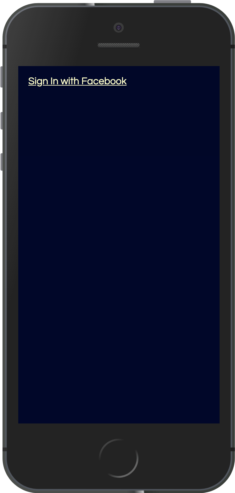 | 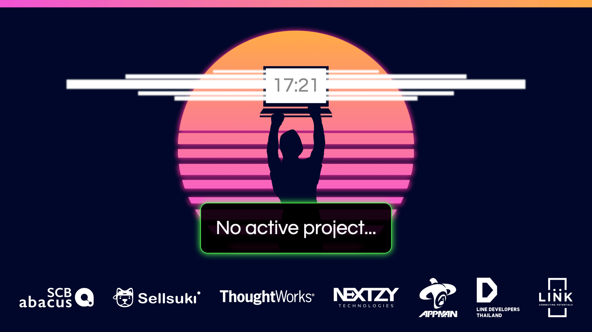 |
| When the pitching time starts, we display the team name on the information screen.                                                                            | 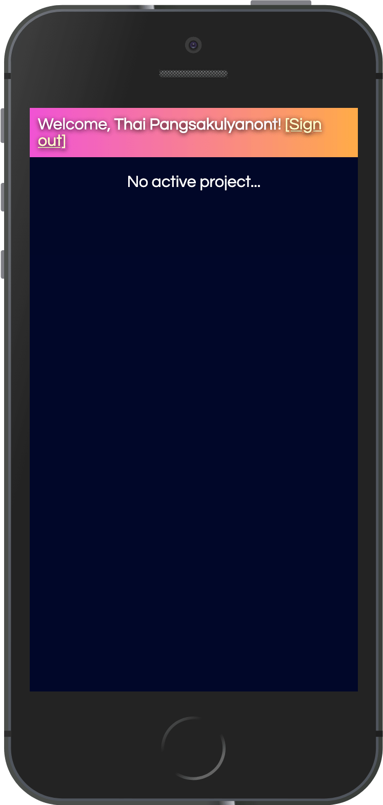 |  |
| As they pitch their project, the audience can give a reaction to that project.                                                                                | 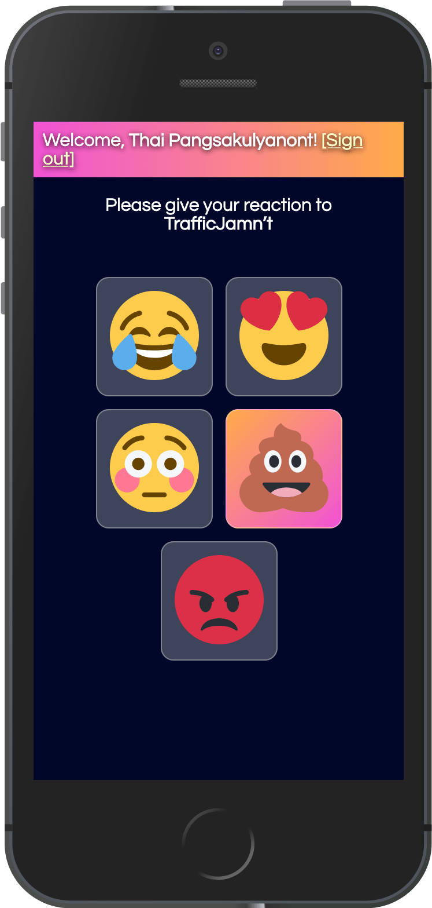 | 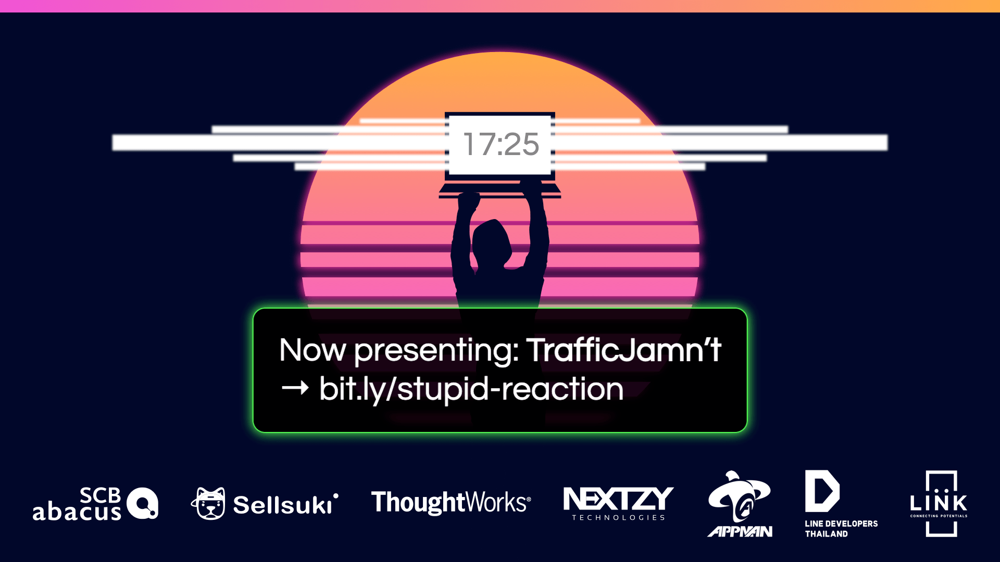 |
| After pitching is finished. We asked the audience once more to give their reactions. The number of reactions received is displayed on the information screen. |  | 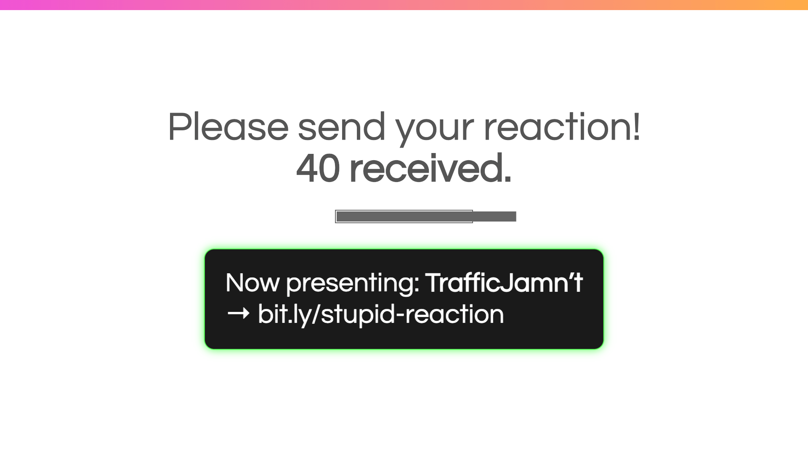 |

This voting system is controlled the a rudimentary admin panel.

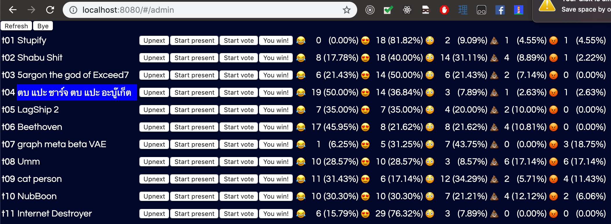

…but first the data must be imported via Firebase console.

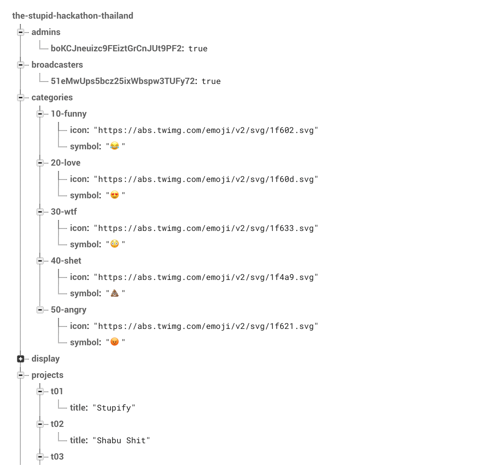
